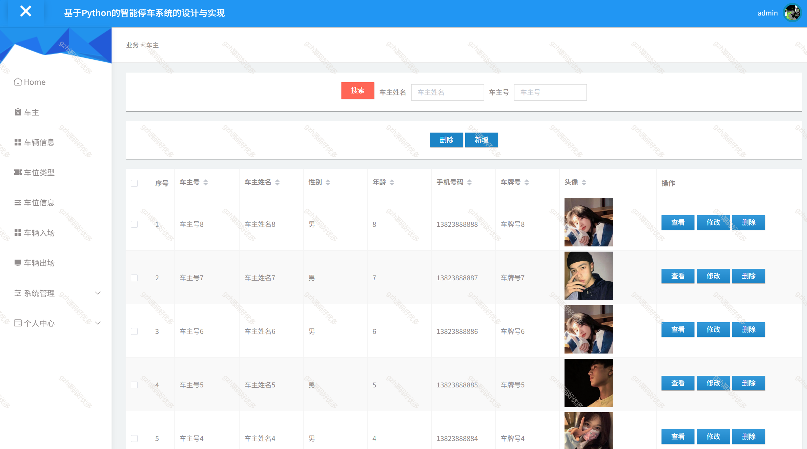

# python035
python035基于Django的智能停车管理系统
 
## 查看主页获取源码

### 一、关键词

智能停车系统、停车管理系统

 

### 二、作品包含

源码+数据库+万字文档+PPT+全套环境和工具资源+部署教程

 

### 三、项目技术

前端技术：Vue.js + Element UI + Axios
后端技术：Python3.7、Django2.0
  

 

### 四、运行环境（以下版本亲测，其他版本未知，请自测）

开发工具：PyCharm + VSCODE

数据库：MySQL5.7

数据库管理工具：Navicat10+

Python3.7、Django2.0

前端Nodejs：16

浏览器：谷歌浏览器

 

### 五、项目介绍

项目编号：python035

随着我国经济的高速发展与人们生活水平的日益提高，人们对生活质量的追求也多种多样。尤其在人们生活节奏不断加快的当下，人们更趋向于足不出户解决生活上的问题，智能停车系统展现了其蓬勃生命力和广阔的前景。与此同时，为解决车主需求，智能停车管理发展愈发多元化与网络化，与电子信息技术相结合。智能停车系统应运而生。

当游客打开系统的网址后，首先看到的就是首页界面。在这里，游客能够看到智能停车系统的导航条显示首页、车位信息、公告信息、个人中心等。

管理员登录进入智能停车系统可以查看主页、车主、车辆信息、车位类型、车位信息、车辆入场、车辆出场、系统管理、个人中心等功能进行详细操作。

 

### 六、运行截图

